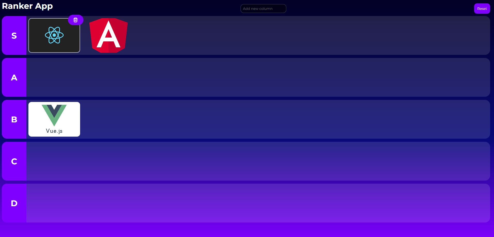

# Ranker

Esse projeto foi feito com o intuito de aprender angular e entender melhor seus conceitos

## Sobre

Essa aplicação tem o objetivo de criar um ambiente para rankeamento de coisas, basta tirar print de qualquer coisa e colar (ctrl + v) para o item aparecer na primeira coluna, apos isso pode ser movido para qualquer outra.

As colunas são personalizaveis, podem ser criadas, removidas e movimentadas na tela para ter um ranqueamento conforme desejar.

A cada alteração no quadro a aplicação se salva automaticamente.

## Como iniciar a aplicação

Clone o projeto:
> git clone https://github.com/fmchtt/ranker.git

Instale as dependencias: 
> npm install

Execute a aplicação:
> npm start
